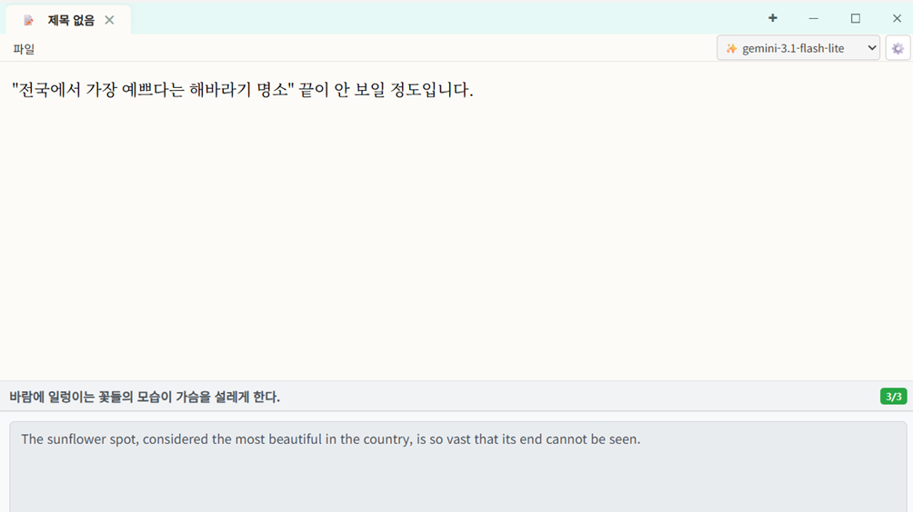

# Note - Editor & AIWriter

Note는 Go와 Webview2를 기반으로 개발된 경량 데스크톱 텍스트 에디터이자 AI 글쓰기 보조 도구다. 윈도우 환경에 최적화된 네이티브 기능을 제공하며, 텍스트 편집과 AI 어시스턴트 연동 기능을 함께 제공한다.

---

## 1. 앱 소개

### 1.1 노트의 특징

| 특징 | 설명 |
| :--- | :--- |
| **컨텍스트 기반 AI** | 편집기에서 선택한 영역 또는 문서 전체 내용을 바탕으로 맞춤형 답변과 추천글을 생성한다. |
| **단어 즉시 해석** | 본문 내 단어 선택 후 `F1` 키를 누르면 설명 팝업이 활성화된다. |
| **윈도우 네이티브 최적화** | 중복 실행 차단(Single Instance), 시스템 트레이 최소화, DWM 기반 Borderless 커스텀 윈도우 스타일을 지원한다. |
| **강력한 보안 및 연동** | API 키를 Windows DPAPI로 암호화하여 로컬에 저장하며 Google, Groq, Ollama, Upstage 등 다양한 API를 지원한다. |

### 1.2 스크린샷



---

## 2. 앱 빌드 방법

### 2.1 사전 준비와 go mod tidy

빌드를 진행하기 전에 시스템에 Go 개발 환경이 올바르게 설치되어 있어야 한다.
프로젝트 루트 디렉토리에서 아래 명령을 실행하여 의존성 모듈을 정리하고 준비한다.
```powershell
go mod tidy
```

### 2.2 build.ps1

컴파일 및 윈도우 리소스 패키징을 자동화하기 위해 제공되는 PowerShell 스크립트를 실행한다.
```powershell
./build.ps1
```
이 스크립트는 다음 작업을 순차적으로 수행한다.
1. 기존 리소스 파일(`*.syso`) 정리
2. `winres/winres.json` 설정을 바탕으로 아이콘 및 매니페스트가 포함된 Windows 리소스 생성 (`go-winres`)
3. 콘솔 창 생성을 억제하는 옵션(`-H windowsgui`)을 포함하여 최적화 빌드 실행
4. 최종 실행 파일 `Note.exe` 생성

---

## 3. AI 사용법

### 3.1 Ctrl+L

- **기능**: 영어 번역 및 대안 추천 기능
- **사용 방법**: 편집창 내에서 특정 텍스트 블록을 드래그하여 선택한 뒤 `Ctrl+L`을 입력한다. 선택한 텍스트에 대한 영어 번역 결과가 하단 패널에 즉시 나타나고, 편집창 아래에 최적의 추천 문구(Ghost Suggestion) 바가 표시된다.

### 3.2 Ctrl+.

- **기능**: AI 어시스턴트 팝업창 활성화
- **사용 방법**: 편집창에서 `Ctrl+.`을 입력하면 전용 AI 어시스턴트 모달 대화창이 실행된다.
  - 선택 영역이 존재할 경우 해당 텍스트를 컨텍스트로 삼아 질문을 던지거나 번역, 요약 작업을 처리한다.
  - 팝업 내에서 `Ctrl+1`부터 `Ctrl+7` 단축키를 사용하여 자주 쓰이는 지시(뜻, 요약, 번역, 개념 확장 등)를 원클릭으로 요청할 수 있다.
  - 생성된 인공지능의 답변은 `Ctrl+Enter` 단축키 혹은 버튼 클릭을 통해 에디터의 커서 위치에 즉시 삽입할 수 있다.

---

## 4. 라이선스

- **문의**: gluedays@gmail.com
- **라이선스**: [MIT License](LICENSE)
